

  

<h1 align="center">Karigar - On-Demand Services App 🛠️</h1>

> **🚀 Architecture Update:** This project was originally built using **Android XML & Kotlin**. To adopt modern Android development practices, the entire architecture has been successfully migrated to **Jetpack Compose, MVVM, and Dagger Hilt**. 
> *To view the legacy XML implementation, check out the [`legacy-xml` branch](https://github.com/Muzzammil-Ahmed-009/Karigar---On-Demand-Services-App/tree/legacy-xml).*

Karigar is a large-scale, production-grade native Android application designed to bridge the gap between customers and professional service providers (Electricians, Plumbers, Painters, Cleaners, etc.). It acts as a comprehensive marketplace offering seamless booking, real-time bidding, in-app communication, and location tracking.

The current repository reflects a robust, scalable architecture built to handle real-world complexities, demonstrating deep expertise in modern Android development.

## 📱 Screenshots (Jetpack Compose UI)

  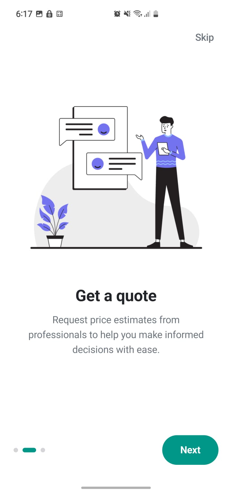
  &nbsp;&nbsp;
  
  &nbsp;&nbsp;
  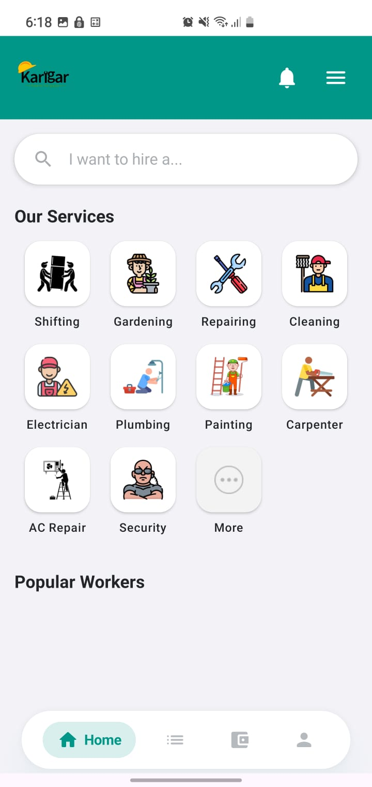
  &nbsp;&nbsp;
  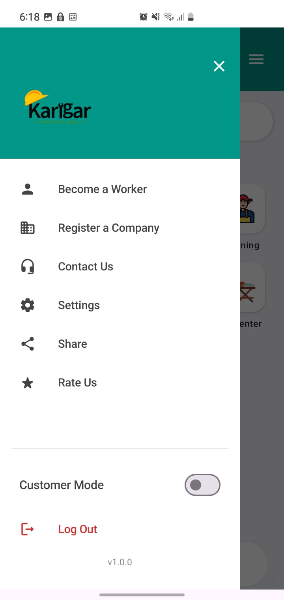

  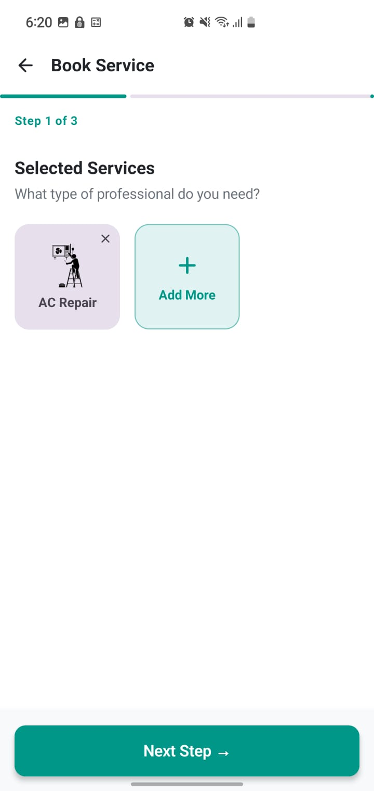
  &nbsp;&nbsp;
  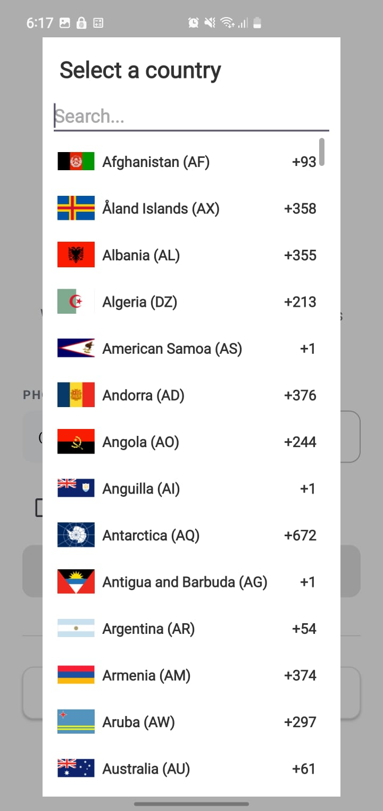
  &nbsp;&nbsp;
  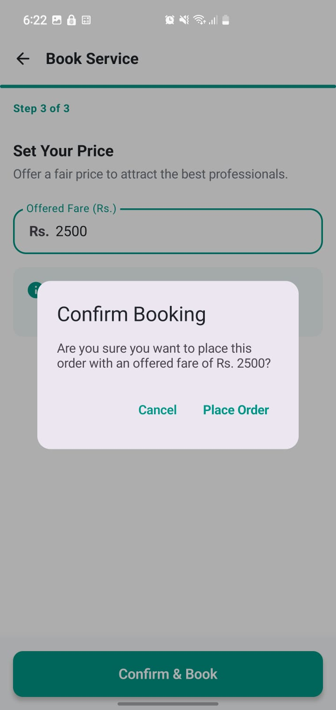
  &nbsp;&nbsp;
  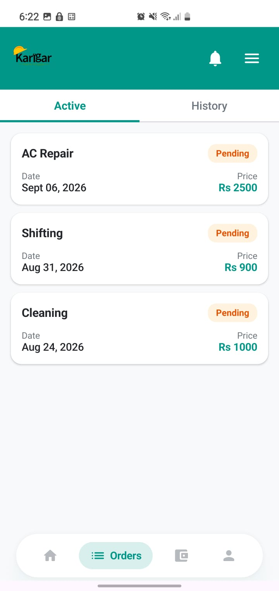

  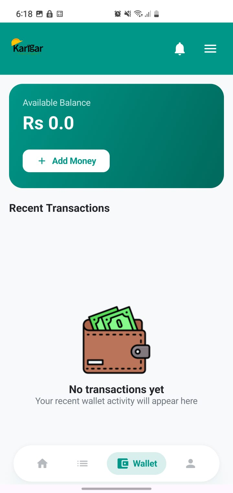
  &nbsp;&nbsp;
  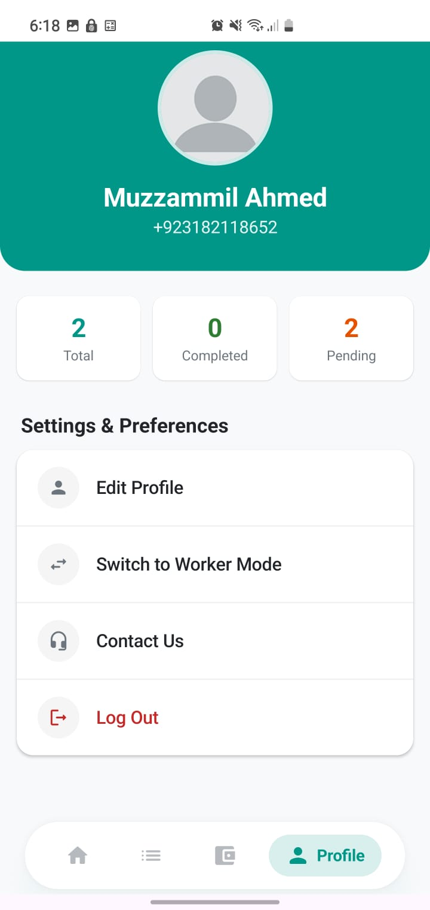
  &nbsp;&nbsp;
  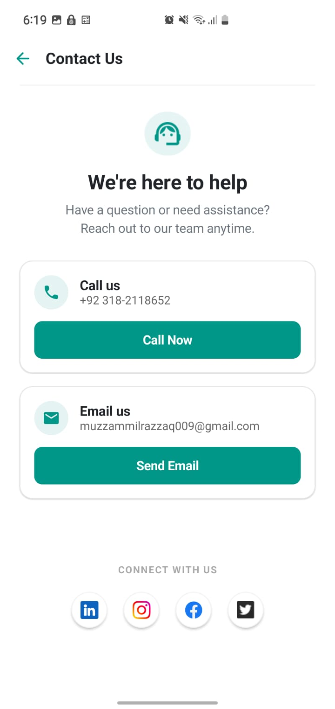
  &nbsp;&nbsp;
  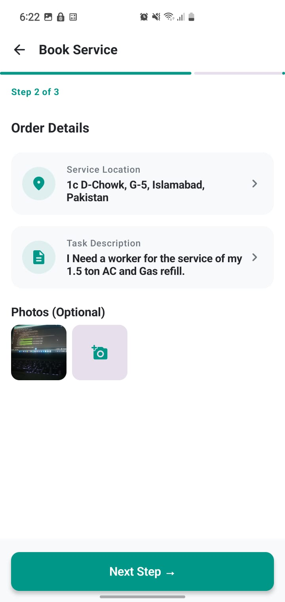

## 🛠️ Tech Stack & Architecture
This project strictly adheres to **Clean Architecture** principles and the **MVVM (Model-View-ViewModel)** design pattern.

- **Language:** Kotlin
- **UI Toolkit:** Jetpack Compose (Declarative UI)
- **Dependency Injection:** Dagger Hilt
- **Asynchronous Programming:** Kotlin Coroutines & StateFlow/SharedFlow
- **Navigation:** Jetpack Compose Navigation
- **Image Loading:** Coil & Glide
- **Backend Infrastructure:** Firebase Ecosystem

## 🔥 Complete Firebase Backend Integration
Unlike standard prototype apps, Karigar is fully integrated with a live backend ecosystem:
- **Firebase Authentication:** Secure user sign-in and session management.
- **Cloud Firestore (NoSQL):** Real-time database powering the core logic (Users, Service Categories, Orders, Bids, Wallet Transactions).
- **Firebase Storage:** Cloud storage for profile pictures and media assets.
- **Real-time Chat System:** Fully functional in-app messaging system built entirely on top of Firestore real-time listeners.

## 🗺️ Google Maps & Location Services
- **Maps SDK for Android (maps-compose):** Integrated interactive maps for accurate location picking and viewing.
- **Google Places API:** Real-time address autocomplete and geocoding integration for seamless user experience during order placement.

## 🎯 Core Features Implemented

### 👤 Customer (User) Module
- **Service Browsing:** Dynamic grid of available services with real-time search filtering.
- **Order Placement & Location:** Users can drop a pin on Google Maps to set exact service locations.
- **Bidding System:** Users receive real-time bids from workers and can accept/reject them.
- **In-App Wallet:** System to manage funds and track transactions.
- **Favorites:** Ability to save preferred workers for future bookings.

### 💼 Service Provider (Worker) Module
- **Dedicated Dashboard:** Separate UI flows for workers to view active and available jobs.
- **Bid Submission:** Workers can submit customized bids on open service requests.
- **Order Management:** Track job statuses from "Pending" to "Completed".

### 💬 Unified Features
- **In-App Chat:** Real-time, peer-to-peer messaging between customers and workers once a bid is accepted.
- **Ratings & Reviews:** Post-service feedback system.

## 🚀 Future Roadmap & Scalability
Because of the massive scope of the application, the foundation has been laid out for the following enterprise-level additions:
- [ ] **Payment Gateway Integration:** Connecting the current Wallet system to a live payment processor like Stripe or Razorpay.
- [ ] **Push Notifications:** Integrating Firebase Cloud Messaging (FCM) to replace local notifications with server-driven background alerts.
- [ ] **Firebase Cloud Functions:** Shifting heavy computational logic (like calculating average ratings or transaction fees) to backend serverless functions.

## 💡 Why this project?
I built this project to demonstrate my ability to architect and develop complex, production-ready Android applications from scratch. Migrating the massive codebase from XML to Jetpack Compose while simultaneously integrating Dagger Hilt, Coroutines, Google Maps, and a full Firebase backend allowed me to showcase my adaptability to modern industry standards and my understanding of scalable mobile app architectures.
